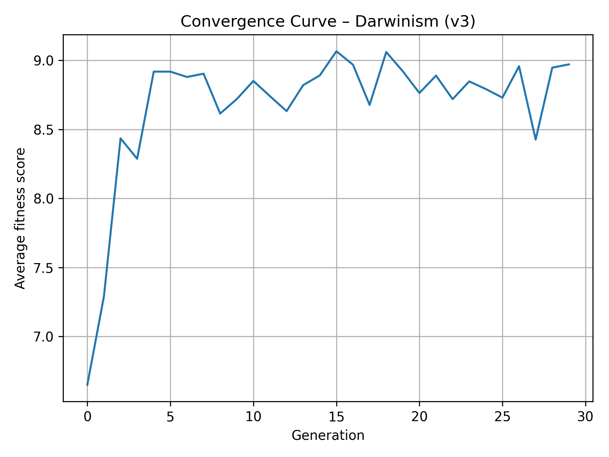

# Self-Organizing Prompt Optimization (S.O.S.)


S.O.S. is an experimental system that **evolves better prompts automatically** using a genetic algorithm. Instead of hand-tuning a prompt, you give it a question and an evaluation criteria, and it breeds a population of prompts across generations — keeping the best, improving, mutating, and crossing them over — until it converges on the most effective prompt for the task.

All generation and evaluation is done locally through [Ollama](https://ollama.com), so no API keys or cloud calls are required.

## Results

A genetic algorithm run on the question *"In a few words, explain how rainbows form"* — the average population fitness climbs and converges across generations:



## How It Works: The Genetic Optimization Cycle

S.O.S. uses a Genetic Algorithm to continuously refine prompts for maximum effectiveness against specified criteria.

### 1. Initial Population (Generation 0)
The system starts by generating a set of diverse initial prompts based on the user's main question, leveraging a highly structured meta-prompt to ensure variety (tone, style, and perspective).

### 2. Evaluation
Each prompt in the current population is tested:
- **Response Generation:** The prompt is submitted to the target LLM (via Ollama) to generate **N samples** (responses).
- **Scoring:** An impartial LLM Evaluator scores each response against the defined **evaluation criteria** (e.g. *"accuracy, language, and level of detail"*). The prompt's final score is the average of all response scores.

### 3. Selection and Reproduction
The prompts are sorted by score. The next generation is created from the high-performing prompts (parents) through the following genetic operations, weighted by the configuration ratios (`elite_ratio`, `improve_ratio`, etc.):

* **Elite (Elitism):** The best prompts are copied directly to the next generation, preserving the highest performance found so far.
* **Improvement (High-level Mutation):** A single parent prompt is submitted to a **Prompt Optimizer LLM** to generate a slightly *better* version.
* **Crossover:** Two high-performing parent prompts are combined by a **Crossover LLM** to create a novel child prompt, fusing their best characteristics.
* **Mutation:** A small, local change (word replacement, rephrasing) is applied to a prompt to maintain diversity and explore nearby solutions.

### 4. Iteration
This cycle repeats for a configured number of generations (`max_generations`), gradually converging on the most effective prompt for the task.

## Project Structure

```
src/
├── main.py                 # Entry point: reads config.json and runs the GA
├── config.json             # All run parameters
├── ga/                     # Genetic algorithm core
│   ├── genetic_algorithm.py
│   ├── prompt_population.py
│   ├── prompt_candidate.py
│   └── evaluation_llm.py
├── llm/                    # LLM provider abstraction
│   ├── llm_client.py
│   ├── base_provider.py
│   └── providers/          # ollama (active), gemini, openai
├── utils/prompt.py         # Meta-prompt templates for each genetic operation
└── data_analysis/          # Convergence plotting tools
```

## Installation

### 1. Install Ollama
Download and install Ollama from [https://ollama.com](https://ollama.com), then pull a model:
```bash
ollama pull llama3.1:8b
```
> Any model supported by Ollama will work. Update `"model"` in `src/config.json` to match the one you pulled.

### 2. Clone the repository
```bash
git clone https://github.com/ArmanRo/Self-Organizing-Prompt-Optimization.git
cd Self-Organizing-Prompt-Optimization
```

### 3. Install Python dependencies
```bash
pip install -r requirements.txt
```

## Configuration

All run parameters live in [`src/config.json`](src/config.json):

| Key | Description |
| --- | --- |
| `llm_provider` | LLM backend to use (currently `ollama`). |
| `model` | Ollama model name, e.g. `llama3.1:8b`. |
| `output_version` | Subfolder name for this run's outputs, saved under `src/results/` (e.g. `v1`). |
| `question` | The task/question prompts are being optimized for. |
| `prompts_amount` | Population size (number of prompts per generation). |
| `evaluation_criteria` | Natural-language criteria the evaluator scores against. |
| `evaluator` | Evaluation strategy (`llm`). |
| `max_generations` | Number of generations to evolve. |
| `evaluation_n_samples` | Responses generated per prompt during evaluation. |
| `evaluation_n_judgments` | Judgments averaged per response. |
| `genetic_algorithm` | Ratios for `elite`, `improve`, `mutate`, and `crossover` operations. |

## Usage

Make sure Ollama is running (`ollama serve`), then start the program:
```bash
python src/main.py
```
Each generation is saved as a JSON file under `src/results/<output_version>/`.

## Analyzing Results

Plot the convergence curve from a run's output folder (matching the `output_version` you used):
```bash
cd src/data_analysis
# Show the curve interactively
python convergence.py ../results/v1
# Or save it to a PNG
python convergence.py ../results/v1 --save graphs/my_run.png --title "My Run"
```

## License

This project is licensed under the [MIT License](LICENSE).
